# 2D Animation

## Workflow

1. Select the Sprite in the **Sprite Editor**. 

2. Build the Sprite Bones hierarchy in the **[Bone Editor](#BoneEditor)** (menu: **Sprite Editor** > **Bone Editor**).

3. Generate and edit geometry, and assign skin weights in the **[Geometry and Weight Editor](#GeoEditor)** (menu: **Sprite Editor** > **Geometry And Weight Editor**).

4. Place the Sprite in a Scene and add the **[Sprite Skin](#SpriteSkin)** component to generate the bones of the Sprite.

5. The Sprite is now ready to be animated.

## Bone Editor

Create and define the bones for your Sprites and their hierarchy in the **Bone Editor**.

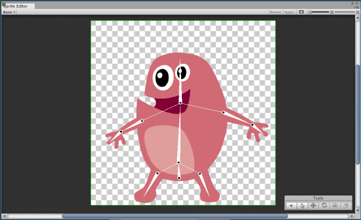

## Create and Edit Bones

There are two tools for creating bones - the **Create Bone Tool**, and the **Create Free Bone** **Tool**. With both tools, the first bone created is the **Root** bone of the Sprite's bone hierarchy. However, both tools parent newly created bones differently. 

If no tools are selected, the **Bone Editor** is in **Transform** mode. In this mode, select and move any bone's *Pivot*, *Body* or *Tail* around to transform its length and size.

### Create Chain Bone tool

Select the **Create Bone** tool and click anywhere in the Sprite to start creating a chain of bones. In **Create Chain Bone** mode, newly created bones are automatically parented to the previous bone in the hierarchy in a continuous chain. To deselect this tool, select **Esc**.

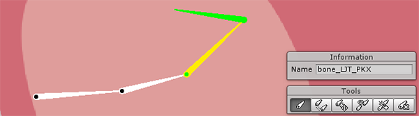	

### Create Free Bone tool

With the **Create Free Bone** tool, new bones are parented to the currently selected bone and ignores the bone chain hierarchy. This is useful if you need to create bones that do not form a continuous chain.

To create a new bone:

1. Select and highlight a bone to be the parent. If no bone is selected, the **Root** bone is the default parent.

2. Select the tool, then click an empty location to set the starting *Pivot* of the new bone.

3. Move the cursor to where the bone should end, and click to set the *Tip* of the bone. 

4. The new bone is created, parented to the bone selected in step 1.

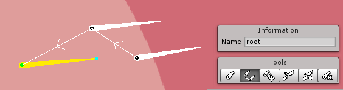

### Free Move Tool

Use the **Free Move** tool to detach a bone from a chain and move it independently, however it is still treated as being parented to its original parent bone.

 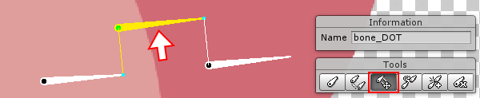

### Parent Tool

The **Parent Tool** is used to change the parent of a child bone. First select the child bone, then select the **Parent Tool**, and finally select a bone to be the new parent.

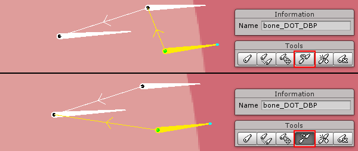

### Split Tool

The **Split Tool** will split a selected bone. First select a bone, then select the **Split Tool**. The selected bone will be split into two even length bones.

 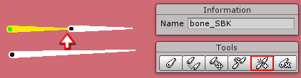

### Delete Tool

Select a bone, then click the **Delete Tool** to remove it.

## Bone Editor Shortcut Keys

|**Tool**|Shortcut|
|:---|:---|
|**Create Chain Bone**|B|
|**Create Free Bone**|N|
|**Free Move**|M|
|**Parent Bone**|P|
|**Split Bone**|S|
|**Delete**|Del|
|*To deselect all tools*|Esc|

## Geometry and Weight Editor

This editor is where Sprite geometry is generated, and vertex weights are then assigned to the bones to deform the geometry.

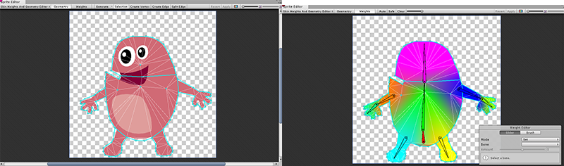

### Generating Geometry Automatically

Sprite geometry can be generated automatically or created manually. 

To auto-generate the mesh, set the editor to *Geometry mode*.

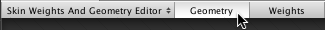

Then select the *Generate* button at the top-left of the menu bar.

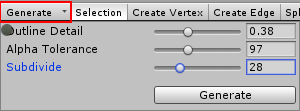

Adjust the following parameters to refine the generated geometric mesh.

|Property|Function|
|:---|:---|
|**Outline Detail**|Density and accuracy of the mesh to the Sprite outline.|
|**Alpha Tolerance**|Threshold for transparency considered when generating the outline.|
|**Subdivide**|Subdivides the mesh to increase tessellation. Higher values increase the tessellation and complexity of the generated mesh.|

### Creating Geometry Manually

Create mesh geometry created manually in the **Create Vertex** or **Create Edge** modes., then double-click within a Sprite's  outline to select it.

 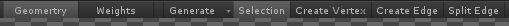

From the top menu, select *Create Vertex* and click anywhere within the Sprite to create vertices. Then select *Create Edge* and click on vertices to connect them together to form new edges. Select *Split Edge* and then click on an edge to split it into multiple pieces.

You can create vertices and new edges directly in *Selection  mode* as well. While in *Selection mode*, double-click anywhere on the Sprite to create vertices. Hold *Shift* to connect a selected vertex to another to create an edge.

## Weights Mode

Select the *Weight  mode*, and then select a Sprite to begin applying skin weights. Click *Auto* 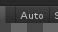 to automatically generate weights based on the Sprite's bones, which can be edited manually later.

### Editing Skin Weights

The **Weight Editor** is used to manually edit skin weights. 

 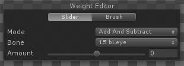

There are two tools to edit the Weights - the *Slider* and the *Brush*. The *Slider* allows direct manipulation of the values of selected vertices; while the *Brush* tool allows you to 'paint' skin weights directly on the mesh.
### Weight Editor Settings

|Property|Function|
|:---|:---|
|**Mode**|Current behavior mode of the Weight Editor|
|&nbsp;&nbsp;**Add and Subtract**|Increases/Decreases influence on vertices around the selected bone|
|&nbsp;&nbsp;**Grow and Shrink**|Increases/Decreases influence on vertices that are already affected by the selected bone. |
|&nbsp;&nbsp;**Smooth**|Averages the weights of vertices with their neighbors, creating smoother deformations.|
|**Bone** (unavailable if *Mode: Smooth*)|Displays currently selected Bone. A different Bone can be selected via the drop-down menu.|
|**Normalize**| Enable to ensure the normalized weight of selected vertices is equal to 1.|
|**Amount**|Amount of weight applied on selected vertices|
|_*Following available in the Brush Weight editor only_|
|**Size**|Size of the brush cursor.|
|**Hardness**|Amount of weight applied by the brush. Higher values increase  the weight per brushstroke.|
|**Step**|Number of increments needed to apply the full weight of brush.|  

The weights for selected vertices can be viewed and further adjusted with the vertex inspector located at the bottom-left of the Editor window.

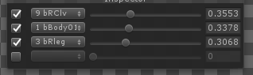

You can preview the effect of the painted weights within the **Sprite Editor**. Select and hold a bone to move or rotate it. The Sprite's geometry mesh deforms according to the weights painted. Releasing the bones resets them and the mesh back to their original state.

## Sprite Skin Component

The **Sprite Skin** component is needed for the bones to deform the Sprite mesh in the Scene.  
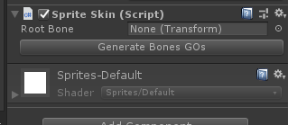  

1. Drag and drop the Sprite Asset onto the Scene after its bones, geometry, and weights have been are set-up in the **Sprite Editor**. 
2. Add the **Sprite Skin** component to the  Sprite. 
3. Click **Create Bones** to generate the bone hierarchy of the Sprite in the Scene.
 

Select and hold a bone to pivot it around its head and deform the Sprite's mesh directly in the Scene to begin animating it.

*Shift+click* to select multiple bones at once. Moving selected bones together deforms the mesh across all of them.

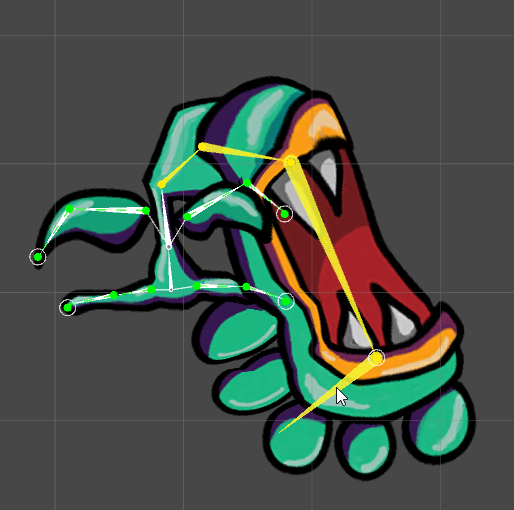

Bones that are not directly chained together can also be selected and moved together.  Areas of the mesh influenced by the *unselected* bones are not deformed.  

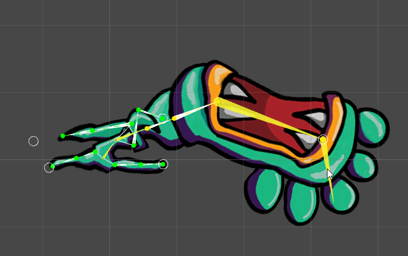

Select and hold the head of a bone to detach it from the previous bone in the chain, the mesh will deform accordingly.  

Use the standard **Transform** tools to deform the Sprite's geometry mesh for greater precision. Note that the **Rect Transform** tool *cannot* be used to transform the bone gizmos.

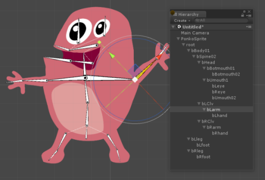

