# 2D Animation

## Workflow

1. Select the **Sprite** in the **Sprite Editor**

2. Build the **Sprite Bones** hierarchy in the **Bone Editor (menu: **Sprite Editor > Bone Editor**)**

3. Generate and edit geometry, and assign skin weights in the **Geometry And Weight Editor** (**menu**: Sprite Editor > Geometry And Weight Editor)

4. Place the **Sprite** in a **Scene** and add the **Sprite Skin** component to generate the bones

5. The **Sprite** is ready to be animated!

## Bone Editor

Create and define the bones for your Sprites and their hierarchy in the **Bone Editor**.

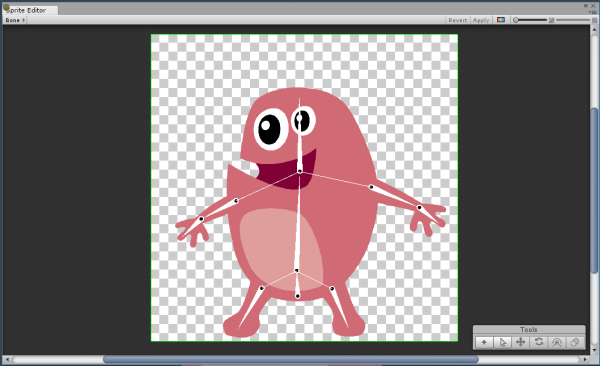

### Create and Edit Bones

You can create bones through two modes - the **Create Chain Bone** mode, and the **Create Free Bone** mode. The first bone created is set as the **Root** bone for the entire hierarchy attached to that specific Sprite.

In **Create Chain Bone** mode, newly created bones are automatically parented to the previous bone in the hierarchy. In **Free Bone mode**, new bones are parented to the currently selected bone regardless of their position in the hierarchy. If a bone is not selected the new bone will be parented to the **Root** bone by default.

When none of these tools are selected, the editor is in **Transform** mode. In this mode, you can select and transform the Pivot, Body and Tail of any bone. 

### Create Bone tool

Select the **Create Bone** tool and click anywhere in the **Sprite **to start creating a chain of bones. Press **Esc** to deselect the tool. In this mode, child bones are parented to the previous bone and linked to the to form a continuous chain. This allows easier manipulation of entire chains of bone lengths and positions.

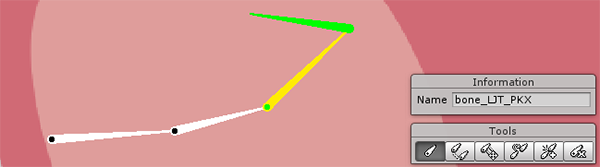​	

### Create Free Bone tool

The **Create Free Bone** tool is used to create bones that are not part of a continuous chain of bones. Select the tool, then click anywhere on the **Sprite** to set the Pivot of the new bone. Next, click to set the Endpoint of the bone, and click again to set the Tip of the bone. A new bone is created that will be parented to either a currently selected bone, or to the Root bone of the hierarchy if no bone is selected.

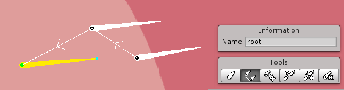

### Free Move Tool

The Free Move tool is used to detach a bone from a chain and move it independently. It will no longer be connected to the chain but will still be parented to it original parent bone.

 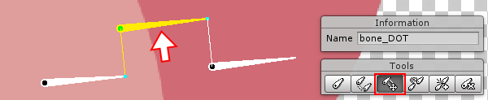

### Parent Tool

The **Parent Tool**** **is used to change the parent of a child bone. First select the child bone, then select the **Parent Tool** then click on the new target parent.

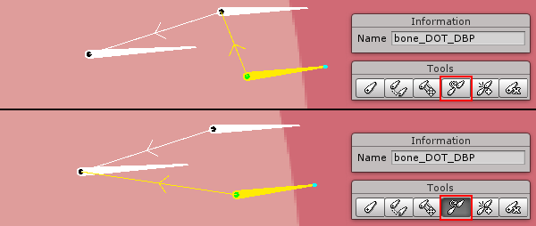

### Split Tool

The **Split Tool** will split a selected bone. First select a bone, then select the **Split Tool**. The selected bone will be split into two.

 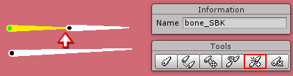

### Delete Tool

Remove bones with the **Delete Tool** by selecting the bone to be removed, then selecting this tool.

## Bone Editor Shortcut Keys

<table>
  <tr>
    <td>Tool</td>
    <td>Shortcut</td>
  </tr>
  <tr>
    <td>Create Bone</td>
    <td>B</td>
  </tr>
  <tr>
    <td>Create Free Bone</td>
    <td>N</td>
  </tr>
  <tr>
    <td>Free Move</td>
    <td>M</td>
  </tr>
  <tr>
    <td>Parent </td>
    <td>P</td>
  </tr>
  <tr>
    <td>Split </td>
    <td>S</td>
  </tr>
  <tr>
    <td>Delete</td>
    <td>Del</td>
  </tr>
  <tr>
    <td>*To deselect all tools</td>
    <td>Esc</td>
  </tr>
</table>

## Geometry and Weight Editor

**Sprite** geometry needs to be generated first before weights can be applied to bind the geometric mesh vertices to the bones of the **Sprite**.

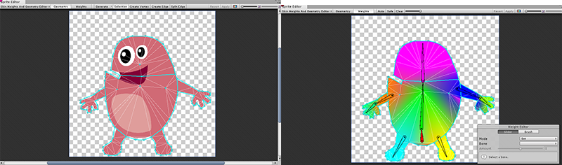

Sprite with generated geometry mesh		Sprite with weights applied 

### Generating Geometry Automatically

**Sprite** geometry can be generated automatically or created manually. 

To auto-generate the mesh, set the editor to **Geometry** mode.

Then select the *Generate* button from the top menu.

 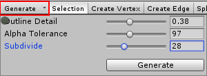

Adjust the following parameters to refine the generated geometric mesh.

<table>
  <tr>
    <td>Parameter</td>
    <td>Description</td>
  </tr>
  <tr>
    <td>Outline Detail</td>
    <td>Density and accuracy of the mesh to the Sprite outline.</td>
  </tr>
  <tr>
    <td>Alpha Tolerance</td>
    <td>Threshold for transparency considered when generating the outline.</td>
  </tr>
  <tr>
    <td>Subdivide</td>
    <td>Subdivides the mesh to increase tessellation. Higher values increase the tessellation and complexity of the generated mesh.</td>
  </tr>
</table>

### Creating Geometry Manually

Mesh geometry can be created manually by using the **Create Vertex** or **Create Edge** modes. Double-click on within a **Sprite's** outline to select it.

 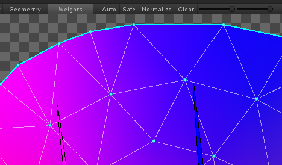

From the top menu, select **Create Vertex** and click anywhere within the **Sprite **selection to begin creating vertices. Then select **Create Edge** and click on vertices to connect them together to form new edges. Edges can be split into additional sections by selecting **Split Edge** and clicking on 

You can perform all these functions directly in **Selection **mode as well. Double-click within the **Sprite **to create vertices. Hold **Shift** to connect a selected vertex to another to create an edge.

## Assigning Skin Weights

Select the **Weights** mode, and then select a **Sprite** to apply skin weights to. Click on the **Auto** button 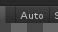 to automatically generate weights based on the **Sprite's** bones. The weight  but can be manually refined if needed. To view 

## Editing Skin Weights

The **Weight Editor** is used to manually edit the skin weights of vertices. There are two ways to 

 

### Weight Editor Settings

<table>
  <tr>
    <td>Parameter</td>
    <td>Description</td>
  </tr>
  <tr>
    <td>Mode</td>
    <td>Current behavior of the Weight Editor</td>
  </tr>
  <tr>
    <td>Add and Subtract</td>
    <td>Increases/Decreases influence on vertices around the selected bone</td>
  </tr>
  <tr>
    <td>Grow and Shrink</td>
    <td>Increases/Decreases influence on vertices that are already affected by the selected bone. </td>
  </tr>
  <tr>
    <td>Smooth</td>
    <td>Averages the weights of vertices with their neighbors, creating smoother deformations</td>
  </tr>
  <tr>
    <td>Bone (not available in Smooth mode)</td>
    <td>Currently selected bone</td>
  </tr>
  <tr>
    <td>Normalize</td>
    <td>Ensures the normalized weight of selected vertices equals to 1</td>
  </tr>
  <tr>
    <td>Amount</td>
    <td>Amount of weight applied on selected vertices</td>
  </tr>
  <tr>
    <td>Following parameters only available in the Brush Weight Editor</td>
    <td></td>
  </tr>
  <tr>
    <td>Size</td>
    <td>Size of the brush cursor</td>
  </tr>
  <tr>
    <td>Hardness</td>
    <td>Amount of weight applied by the brush. Higher values increase  the amount of weight per brushstroke.</td>
  </tr>
  <tr>
    <td>Step</td>
    <td>Number of steps need to apply the full weight of brush.</td>
  </tr>
</table>

The weights for selected vertices can be viewed and further adjusted with the vertex inspector located at the bottom-left of the Editor window.

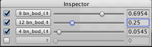

 

You can preview the effect of the painted weights within the **Sprite Editor**. Select and hold a bone at its head to move it freely, or select another part of the bone to pivot it around its head. The **Sprite** mesh deforms according to the weights painted. Releasing the bones resets them and the mesh back to their default positions.

# 

# Sprite Skin Component

The **Sprite Skin** component is required for the bones to deform the **Sprite** mesh. Drag and drop the **Sprite Asset** onto the **Scene** after setting up its bones, geometry and weights in the **Sprite Editor**. Add the **Sprite Skin** component to the **Sprite**. Click **Create Bones** to generate the bone hierarchy of the **Sprite** within the **Scene**.

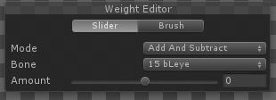 

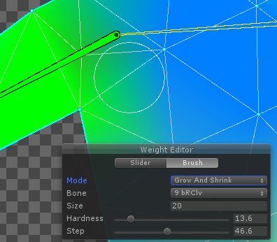

Select and hold a bone to pivot it around its head and deform the **Sprite **mesh directly in the **Scene** for animation.

**Shift+click** different bones to select or deselect them, multiple bones can be selected in this way. Moving selected bones together deforms the mesh across their total length.

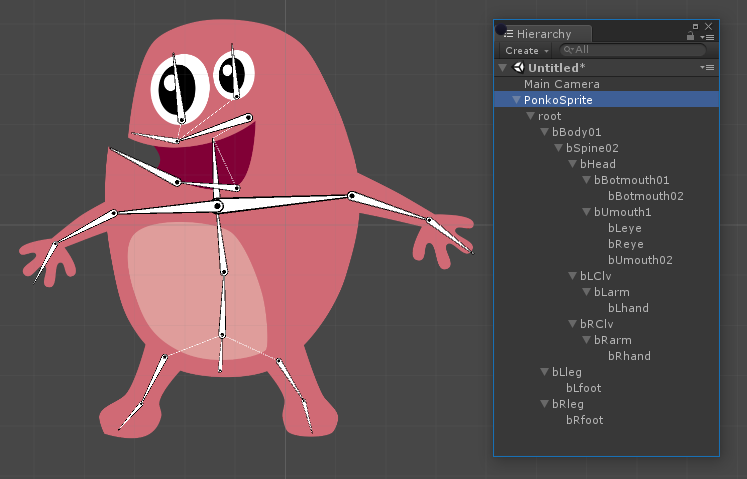

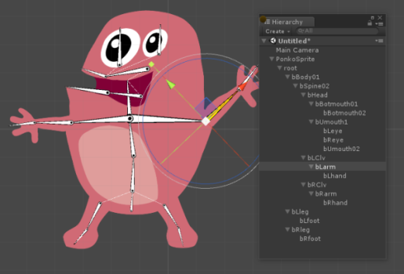

Bones that are not directly chained together can also be selected and moved together.  Areas of the mesh influenced by the unselected bone are not deformed. 

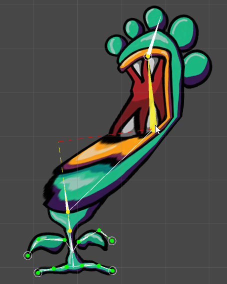

Select and hold the head of a bone to detach it from the previous bone in the chain, the mesh will deform accordingly.

The standard **Transform** tools can also be used to to deform the **Sprite's** geometry mesh for greater precision. Note that the **Rect Transform** tool cannot be used to transform the bone gizmos.

